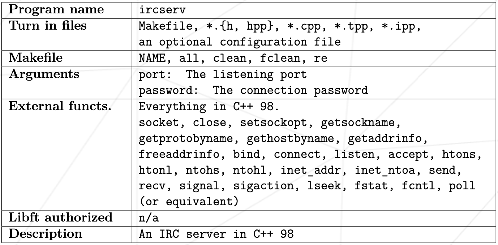

# ft_irc

C++ 98로 IRC 서버를 개발해야 한다.

클라이언트를 개발해서는 안된다.

서버 간 통신을 처리해서는 안된다.

실행 파일은 다음과 같이 실행될 것이다:
`./ircserv <port> <password>`

- **port**: IRC 서버가 들어오는 IRC 연결을 수신할 포트 번호.
- **password**: IRC 서버에 연결할 비밀번호. 서버에 연결을 시도하는 모든 클라이언트에게 필요하다.

> subject와 evaluation scale에는 `poll()`이 언급되지만 `select()`, `kqueue()`, `epoll()` 등과 같이 상응하는 함수를 사용할 수 있다.
